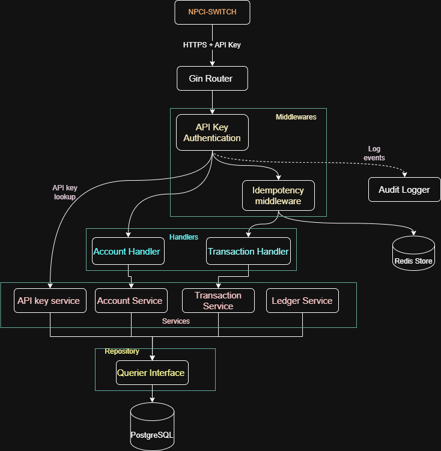

## Overview

This project is a high-concurrency, production-grade banking service designed as a core component of a larger UPI (Unified Payments Interface) ecosystem. It serves as the primary authoritative ledger and account management system that communicates with an NPCI (National Payments Corporation of India) switch to facilitate real-time peer-to-peer transactions.

---

## Key Features

- **Atomic Transactions**  
  Utilizes PostgreSQL transactions and strict balance constraints to ensure debits and credits are executed as a single unit of work.

- **Distributed Idempotency**  
  Implements a Redis-backed middleware to handle network retries gracefully, preventing duplicate processing of the same transaction.
  
- **Double-Entry Ledger**  
  Every movement of funds creates two immutable ledger entries—one for the user and one for the system settlement account—ensuring auditability.

- **Secure Authentication**  
  API Key-based security with SHA-256 hashing, expiration tracking, and CIDR-based IP whitelisting.

- **Audit Logging**  
  A structured logging system tracks authentication successes, failures, and critical system events for security auditing.

---

## Architecture

The project follows a clean Handler-Service-Repository pattern to ensure a separation of concerns and ease of testing.

---

## Tech Stack

- **Language:** Go (Golang)  
- **Database:** PostgreSQL (Primary Store)  
- **Cache:** Redis (Idempotency Store)  
- **Web Framework:** Gin Gonic  
- **Database Tools:** sqlc (Type-safe SQL), goose (Migrations)
